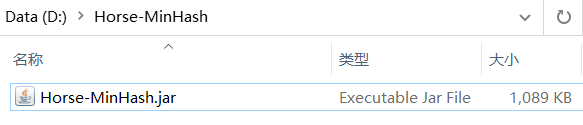
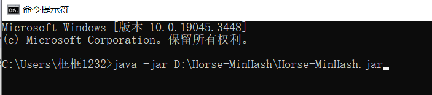
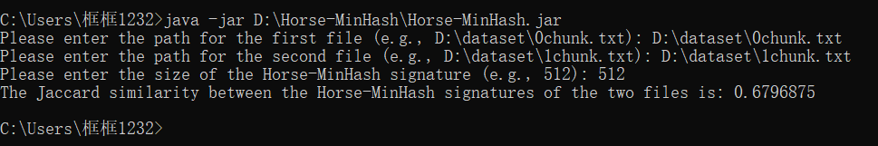

# Horse-MinHash-Java

## An Implementation of Horse-MinHash in Java

Horse-MinHash is a high-performance and secure Jaccard similarity estimator that achieves higher accuracy than traditional MinHash and its variants.

Additionally, it exhibits superior performance in Jaccard similarity estimation, particularly when the block size is 16KB or larger.

## Related Papers:

- Zhixiong Xie, Wenlong Tian*, Jianfeng Lu, Weijun Xiao, and Zhiyong Xu. 2025. High-Performance and Secure Jaccard Similarity Estimation for Cloud Storage. In Companion of the 16th ACM/SPEC International Conference on Performance Engineering (WWW Companion ’25), April 28-May 2, 2025, Sydney, NSW, Australia. ACM, New York, NY, USA. https://doi.org/10.1145/3701716.3715588   

High-Performance and Secure Jaccard Similarity Estimation for Cloud Storage © 2025 by Wenlong Tian, Zhixiong Xie, Jianfeng Lu, Weijun Xiao, Zhiyong Xu is licensed under Creative Commons Attribution-NonCommercial-NoDerivatives 4.0 International. To view a copy of this license, visit https://creativecommons.org/licenses/by-nc-nd/4.0/.  

## Requirements:

- Requires at least **Java 17**.

## Examples

- To generate Horse-MinHash signatures for two files and estimate their Jaccard similarity, you can utilize the Command Prompt (CMD) to execute the Horse-MinHash.jar file.

  

- Use the following command in CMD to run the JAR file: `java -jar [absolute path to Horse-MinHash.jar]`.

  

- Horse-MinHash requires three input parameters: the first two are the file paths for which you want to calculate Jaccard similarity, and the third is the user-defined size of the Horse-MinHash signature.

  

